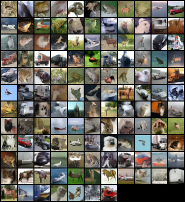
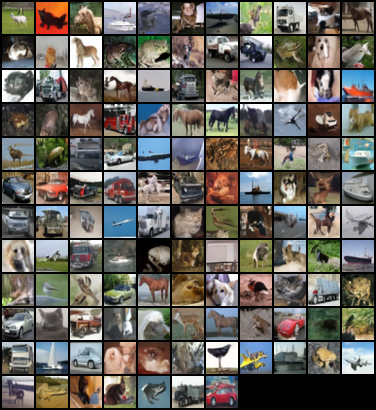

# Blurring Diffusion Models - Pytorch
|  |
|:--:|
| *Figure 1: Blurring Diffusion.* |

|  |
|:--:|
| *Figure 2: Normal Denoising Diffusion.* |


This repository is the unofficial pytorch implementation of the methods in the publication:

* Emiel Hoogeboom and Tim Salimans (2023). **Blurring Diffusion Models**. In *International Conference on Learning Representations (ICLR)*. [[arXiv]](https://arxiv.org/abs/2209.05557) 

Currently, we have only tried training on CIFAR10.


## Arrangement of code
We use the [AaltoML/generative-inverse-heat-dissipation](https://github.com/AaltoML/generative-inverse-heat-dissipation) as our base codebase and added `model_code/blurring_diffusion.py` and `scripts/sampling_bd.py` files for additional utility. Please refer to the `README_hd.md` for training heat-dissipation models.

The "`configs`" folder contains the configuration details on different experiments and the "`data`" folder contains the data. CIFAR-10 should run as-is with automatic torchvision data loading. The "`model_code`" contains the U-Net definition and utilities for working with the proposed inverse heat dissipation model. "`scripts`" contains additional code, for i/o, data loading, loss calculation and sampling. "`runs`" is where the results get saved at.


## Used Python packages

The file "requirements.txt" contains the Python packages necessary to run the code, and they can be installed by running

```pip install -r requirements.txt```

If you have issues with installing the `mpi4py` through pip, you can also install it using conda with `conda install -c conda-forge mpi4py`. 

## Training

You can get started by running an CIFAR10 training script with

```bash
python train_bd.py --config configs/cifar10/default_cifar10_configs_bd.py --workdir runs_bd/cifar10/default
```

This creates a folder "`runs_bd/cifar10/default`", which contains the folder "`checkpoint-meta`", where the newest checkpoint is saved periodically. "`samples`" folder contains samples saved during training. You can change the frequency of checkpointing and sampling with the command line flags "`training.snapshot_freq_for_preemption=?`" and "`config.training.sampling_freq=?`". 


You can also train model with no blurring by setting "`model.blur_sigma_max=0`" in the config file as done in "`configs/cifar10/default_cifar10_configs_bd_noblur.py`". This model corresponds to a simple DDPM style model.

```bash
python train_bd.py --config configs/cifar10/default_cifar10_configs_bd_noblur.py --workdir runs_bd/cifar10/default
```

## Sampling
Once you have at least one checkpoint, you can do sampling with "`sample_bd.py`":

### Random samples
Random samples: 

```bash
python sample_bd.py --config configs/cifar10/default_cifar10_configs_bd.py
                 --workdir runs_bd/cifar10/default --checkpoint 0 --batch_size=9
```


## Evaluation

The script "`evaluation_bd.py`" contains code for evaluating the model with FID-scores. For example, if you have a trained cifar-10 model trained with `configs/cifar10/default_cifar10_configs_bd.py` and the result is in the folder `runs_bd/cifar10/default/checkpoints-meta`, you can run the following (checkpoint=0 refers to the last checkpoint, other checkpoints in `runs_bd/cifar10/default/checkpoints` are numbered as 1,2,3,...):

### FID scores
This assumes that you have `clean-fid` installed. 

```bash
python evaluate.py --config configs/cifar10/default_cifar10_configs_bd.py
            --workdir runs_bd/cifar10/default --checkpoint 0
            --dataset_name=cifar10
            --experiment_name=experiment1 --param_name=default --mode=fid
            --dataset_name_cleanfid=cifar10
            --dataset_split=train --batch_size=128 --num_gen=50000
```


### Result folder
The results will be saved in the folder `runs/cifar10/evaluation_results/experiment1/` in log files, where you can read them out. The idea in general is that `experiment_name` is an upper-level name for a suite of experiments that you might want to have (e.g., FID w.r.t. different delta), and `param_name` is the name of the calculated value within that experiment (e.g., "delta0.013" or "delta0.012"). 

## Results
We performed some preliminary runs CIFAR10 and we report the numbers below:
<!-- |experiment           | config | blur_sigma_max | train iters | FID (train) |
| ------- | -------- | ------- | ------- | ------- |
| Denoising Diffusion | configs/cifar10/default_cifar10_configs_bd_noblur.py | 0     | 109800| 16.558|
| Blurring Diffusion  | configs/cifar10/default_cifar10_configs_bd.py        | 20    | 144400| 23.393| -->

|| *Blurring Diffusion.* | *Denoising Diffusion* |
|:--:|:--:|:--:|
|config|configs/cifar10/default_cifar10_configs_bd.py|configs/cifar10/default_cifar10_configs_bd_noblur.py|
|blur_sigma_max|20|0|
|train iters|114400|109800|
|FID (train)|23.393|16.558|
|Samples|  |  |
|Process Visualization|  |  |


The paper hints towards blur diffusion only overtaking less blurry diffusion after 200K iterations because blurring acts as a regularizer and hence takes more time to train. We did not run the experiments for that long.

## TODO

- [x] CIFAR10
    - [x] utility functions
    - [x] training script and config files
    - [x] sampling script
    - [x] evaluation script
    - [x] results

## Citation

This repo was created by [prateksha](https://github.com/prateksha) and [soumik-kanad](https://github.com/soumik-kanad). Please condider giving us a ⭐ if you find it useful. 

If you use the code in this repository for your research, please cite the paper as follows:

```bibtex
@inproceedings{
hoogeboom2023blurring,
title={Blurring Diffusion Models},
author={Emiel Hoogeboom and Tim Salimans},
booktitle={The Eleventh International Conference on Learning Representations },
year={2023},
url={https://openreview.net/forum?id=OjDkC57x5sz}
}
```

## License

This software is provided under the [MIT license](LICENSE).

This repository has been forked from [AaltoML/generative-inverse-heat-dissipation](https://github.com/AaltoML/generative-inverse-heat-dissipation) which is also provided under the [MIT icense](https://github.com/AaltoML/generative-inverse-heat-dissipation/blob/main/LICENSE).
````
